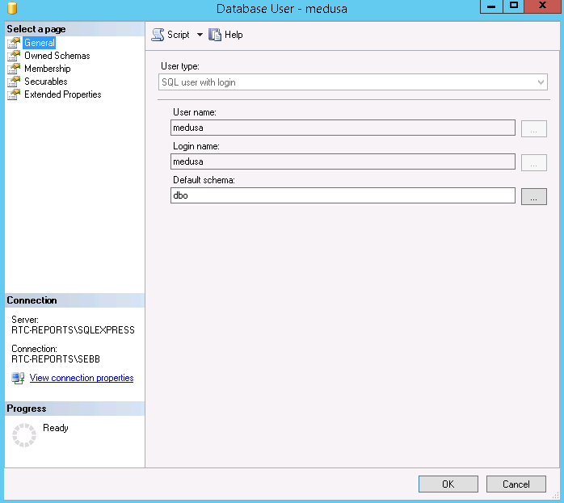
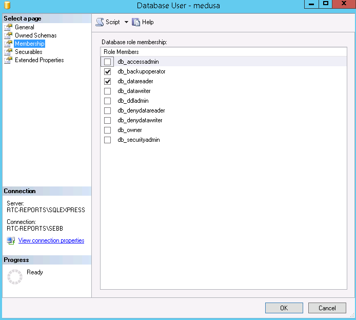

# Medusa System Agent

## Description
Medusa System Agent is a tool that logs into and exports site data from a SQL database as a CSV to local storage. Once the data is cloned to remote storage (by Chimera), System Agent purges the local files.

Medusa is designed to integrate with a cloud backup agent, like Chimera. System Agent can be executed before and after each backup job to prepare the data, then clean up.

## Installation and setup

### Create a SQL Server read-only user
1. Open SQL Server Management Studio and login as a user with `sysadmin` role.
2. In the Object Explorer, expand the database to be exported > Security > Users. Right-click > New User...

3. Under General, enter the `User name` and `Login name`.

4. Under Membership, check `db_backupoperator` and `db_datareader`.

5. Click OK.

### Generate the configuration file
1. In the Medusa dashboard, navigate to the correct facility and select Settings.
2. Check "Enable System Agent" and click Download Config. A zip file downloads containing the Medusa System Agent and Chimera config files.
3. For custom systems, modify the config files to suit.

### Install Medusa System Agent
1. Download the latest version Medusa System Agent msi from [here](https://github.com/SEBA-Smart-Services/medusa-system-agent/releases).
2. On the local server, run Medusa.System.Agent-xxx.msi to install Medusa System Agent.
3. Open a new command prompt (medusa-agent has been added to PATH, CMD will need to be reopened to load the new PATH).
4. Run `medusa-agent` in command prompt. This will instantiate the data directories.
5. Copy the downloaded Medusa System Agent config.ini into `%programdata%\medusa-agent`.

### Install Chimera
1. Download the latest version of Chimera Backup Agent for Windows from [here]().
2. On the local server, run  chimera-win-xxx.msi to install Chimera.
3. Navigate to `%programfilesx86%\Chimera\Chimera Backup Agent\winservice` and run `install_service_xxx.bat`, where `xxx` is the OS architecture.
4. Copy the downloaded Chimera `config.ini` into `%programfilesx86%\Chimera\Chimera Backup Agent`.
7. Copy the downloaded Chimera job config file into `%programfilesx86%\Chimera\Chimera Backup Agent`.
8. In Windows Services, start Chimera.

## Troubleshooting
Inspect the log files in `%programdata%\medusa-agent\log`.

## Custom deployments
TODO:
- explain config file
- explain how to customize tables

## Building from source
Read [cx_Freeze documentation](https://cx-freeze.readthedocs.io/en/latest/).
Run `python setup.py bdist_msi`

## Releasing a new version
1. On both a 32-bit and 64-bit development Windows machine, uninstall any existing versions.
2. Develop the python application.
3. Test the python application.
4. On the 64-bit machine:
 1. Remove any config files or %programdata% directories associated with the production application.
 2. Build the MSI, see [Building from source](#building-from-source).
 3. Run the MSI to install the Windows application.
 4. Check config is correct and test the Windows application.
5. Repeat the above steps for the 32-bit machine.
6. If everything passes, tag the git branch with the correct version number (using [Semantic Versioning](http://semver.org/) and push to Github:

```
git tag -a vX.X.X -m "Medusa System Agent version X.X.X"
git add .
git commit -m "release vX.X.X"
git push origin master
```

7. In Github, create a new release, pointing it to the newly created tag. Annotate the release notes.

## TODO
- Ditribute latest version of Chimera with Medusa System Agent to ease install and setup.
- Build installer that downloads direct from Medusa that contains pre-populated configuration to install and setup.
- Support multiple database engines, including SQLite.
- Create data directories and copy in files on install.

